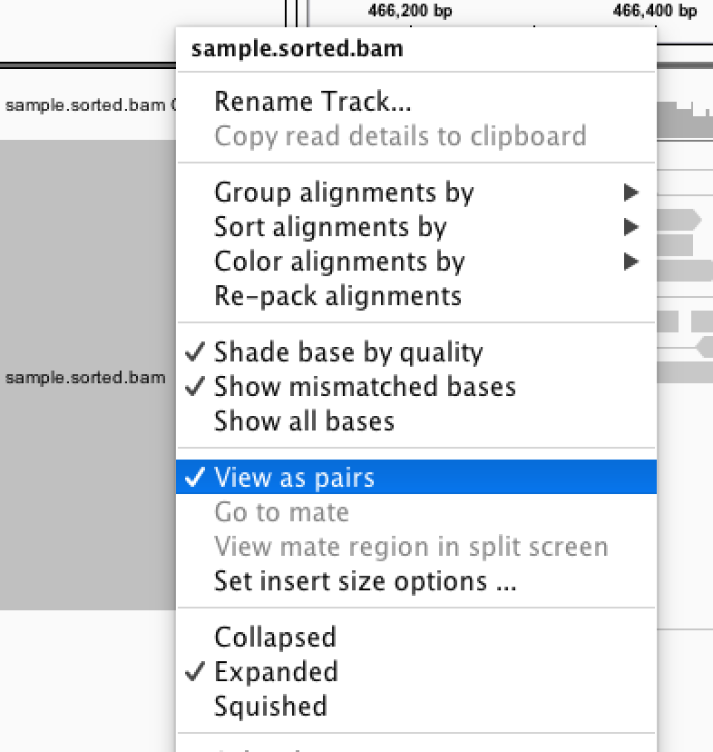
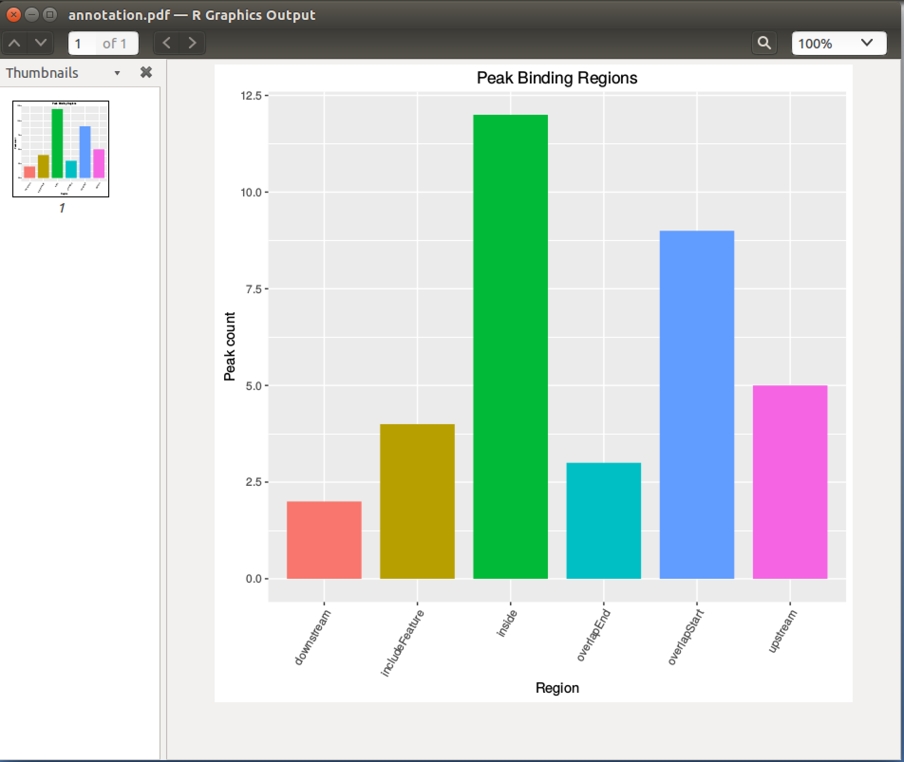

## 公開データの取得

### データの確認

```
cd /home/iu/chipseq/data
ls data
```

## QC

### fastqcの実行｜クリーニング前

```
mkdir fastqc_before
```

```
fastqc --nogroup -t 2 -o ./fastqc_before \
    data/input_1.fastq.gz \
    data/input_2.fastq.gz \
    data/sample_1.fastq.gz \
    data/sample_2.fastq.gz
```

### fastqcの結果確認｜クリーニング前

```
firefox \
    fastqc_before/input_1_fastqc/fastqc_report.html \
    fastqc_before/input_2_fastqc/fastqc_report.html \
    fastqc_before/sample_1_fastqc/fastqc_report.html \
    fastqc_before/sample_2_fastqc/fastqc_report.html
```

### Trimming

```
mkdir trimmed_data
```

```
java -jar /usr/local/bin/trimmomatic-0.36.jar PE \
    -threads 2 -phred33 \
    data/input_1.fastq.gz \
    data/input_2.fastq.gz \
    trimmed_data/input_1_paired.fastq \
    trimmed_data/input_1_unpaired.fastq \
    trimmed_data/input_2_paired.fastq \
    trimmed_data/input_2_unpaired.fastq \
    LEADING:20 TRAILING:20 SLIDINGWINDOW:4:15 MINLEN:36
```

```
java -jar /usr/local/bin/trimmomatic-0.36.jar PE \
    -threads 2 -phred33 \
    data/sample_1.fastq.gz \
    data/sample_2.fastq.gz \
    trimmed_data/sample_1_paired.fastq \
    trimmed_data/sample_1_unpaired.fastq \
    trimmed_data/sample_2_paired.fastq \
    trimmed_data/sample_2_unpaired.fastq \
    LEADING:20 TRAILING:20 SLIDINGWINDOW:4:15 MINLEN:36
```

### TIPS｜CPUコア数を確認してみる

```
cat /proc/cpuinfo
```

### fastqcの実行｜クリーニング後

```
mkdir fastqc_after
```

```
fastqc --nogroup -t 2 -o fastqc_after \
    trimmed_data/input_1_paired.fastq \
    trimmed_data/input_2_paired.fastq \
    trimmed_data/sample_1_paired.fastq \
    trimmed_data/sample_2_paired.fastq
```

### fastqcの結果確認｜クリーニング後

```
firefox \
    fastqc_after/input_1_paired_fastqc/fastqc_report.html \
    fastqc_after/input_2_paired_fastqc/fastqc_report.html \
    fastqc_after/sample_1_paired_fastqc/fastqc_report.html \
    fastqc_after/sample_2_paired_fastqc/fastqc_report.html
```

## マッピング

```
mkdir mapping
```

### inputデータ

```
bowtie2 -p 2 -x /home/iu/genome/sacCer3/Bowtie2Index/genome \
    -1 trimmed_data/input_1_paired.fastq \
    -2 trimmed_data/input_2_paired.fastq | \
        samtools view -Sb - > mapping/input.bam
```

```
samtools sort mapping/input.bam -o mapping/input.sorted.bam
```

### sampleデータ
```
bowtie2 -p 2 -x /home/iu/genome/sacCer3/Bowtie2Index/genome \
    -1 trimmed_data/sample_1_paired.fastq \
    -2 trimmed_data/sample_2_paired.fastq | \
        samtools view -Sb - > mapping/sample.bam
```

```
samtools sort mapping/sample.bam -o mapping/sample.sorted.bam
```

## ピーク検出

### MACS2によるピーク検出

```
macs2 callpeak \
    -t mapping/sample.sorted.bam \
    -c mapping/input.sorted.bam \
    --outdir macs2_res \
    -f BAMPE \
    -n handson2016 \
    -B \
    -q 0.01 \
    -g 1.2e+7
```

### 検出結果の確認

```
head -5 handson2016_peaks.narrowPeak
```

## 可視化

### BAMファイルのインデックスを作成

```
cd mapping
```

```
samtools index input.sorted.bam
samtools index sample.sorted.bam
```

### スコアの高いピークを確認

```
cd peak_detection
cat handson2016_summits.bed | sort -k 5n
```

### リードがペアで見えない場合は
IGVでリードのペアを繋いで表示するには、 `view as pair` を有効にします



## アノテーション

```
mkdir annotation
cd annotation
```

### アノテーション前のファイルを確認

```
cat ../macs2_res/handson2016_summits.bed
```

### SnpEffによるアノテーション

```
java -jar /usr/local/bin/snpEff.jar eff \
    -csvStats stats.txt \
    -c /usr/local/bin/snpEff.config \
    -i bed \
    -o bedAnn R64-1-1.82 \
    ../macs2_res/handson2016_summits.bed > \
        handson2016_summits.annotated.bed
```

### アノテーションしたファイルの確認

```
less handson2016_summits.annotated.bed
```

## モチーフ探索

```
mkdir ../motif
cd ../motif
```

### rGADEMを使用してモチーフ探索

```
R
```

```r
library(rGADEM)
library("BSgenome.Scerevisiae.UCSC.sacCer3")

BED <- read.table("../macs2_res/handson2016_peaks.narrowPeak", header=FALSE, sep="\t")
BED <- data.frame(chr=as.factor(BED[,1]),start=as.numeric(BED[,2]),end=as.numeric(BED[,3]))

rgBED<-IRanges(start=BED[,2],end=BED[,3])
Sequences<-RangedData(rgBED,space=BED[,1])
gadem<-GADEM(Sequences,verbose=1,genome=Scerevisiae)

pdf("motif.pdf")
plot(gadem)
dev.off()

q()
```

### PDFを確認

```
evince motif.pdf
```


## EXTRA STAGE

### ChIPpeakAnnoを用いてピークのアノテーションを行う

このセクションは2016年7月28日の講義中に受講生の熱い要望を受け追加しました。  
講義中で使用した `snpEff` 以外のアノテーション方法を示したものです。

また、この内容は講義資料のPDFには含まれておりませんのでご注意ください。

### 要約
下記のコマンドを `/home/iu/chipseq/` で実行します。

```
mkdir chippeakanno
cd chippeakanno
R
```

Rを起動して下記のコマンドを実行します。  
`/home/iu/chipseq/chippeakanno` に下記のファイルが出力されます。

- `annotated.bed`
    - アノテーション済みのBEDファイル
- `annotation_summary.txt`
    - アノテーションされた領域の集計情報
- `annotation.pdf`
    - アノテーションされた領域を図示したもの

```R
library(ChIPpeakAnno)

ensembl = useMart(biomart="ENSEMBL_MART_ENSEMBL", host="www.ensembl.org")
sacCer3 <- useDataset("scerevisiae_gene_ensembl", mart=ensembl)
ann.data <- getAnnotation(mart=sacCer3, featureType="TSS")

bed.df <- read.table("../macs2_res/handson2016_peaks.narrowPeak", header=FALSE, sep="\t")
bed.gr <- BED2RangedData(bed.df[1:4], header = FALSE)

bed.anno <- annotatePeakInBatch(RangedData(bed.gr), AnnotationData = ann.data, output = "both")
bed.anno.table <- table(as.data.frame(bed.anno)$insideFeature)

write.table(bed.anno.table, "annotation_summary.txt", quote=FALSE, sep="\t")
write.table(as.data.frame(bed.anno), "annotated.bed", quote=FALSE, sep="\t", row.names=FALSE)

library(ggplot2)

fortify.table <- function(model, ...) {
  data <- reshape2::melt(model)
  return(data)
}

reshape.bed <- reshape2::melt(bed.anno.table)
reshape.bed
pdf("annotation.pdf")
g <- ggplot(data=reshape.bed, aes(x=Var1, y=value, fill=Var1))
g <- g + guides(fill=FALSE)
g <- g + geom_bar(width=0.8, stat='identity')
g <- g + xlab('Region')
g <- g + ylab('Peak count')
g <- g + ggtitle('Peak Binding Regions')
g <- g + theme(axis.text.x = element_text(angle=60, hjust=1))
plot(g)
dev.off()
```

出力されるグラフの例



### 解説
おおまかな流れとともにコマンドを紹介します。

ライブラリを読み込みます。  
今回はデータの取得に `biomaRt` を使用していますが、 `ChIPpeakAnno` の読み込み時に同時にロードされるので個別の読み込みは不要です。

```R
library(ChIPpeakAnno)
```

アノテーションデータを取得します。  
`ChIPpeakAnno` には幾つかの生物種についてデータが同梱されていますが、sacCer3のデータは存在しないため、別途取得する必要があります。  
ここでは、 `biomaRt` を使用して、ensemblよりTSSのデータを取得します。

```R
ensembl = useMart(biomart="ENSEMBL_MART_ENSEMBL", host="www.ensembl.org")
sacCer3 <- useDataset("scerevisiae_gene_ensembl", mart=ensembl)
ann.data <- getAnnotation(mart=sacCer3, featureType="TSS")
```

ピークデータを読み込みます。

```R
bed.df <- read.table("../macs2_res/handson2016_peaks.narrowPeak", header=FALSE, sep="\t")
```

領域の情報を計算します。  
不要なピークのスコアなどは使用しないように `bed.df[1:4]` と指定します。

```R
bed.gr <- BED2RangedData(bed.df[1:4], header = FALSE)
```

アノテーションを実施します。

```R
bed.anno <- annotatePeakInBatch(RangedData(bed.gr), AnnotationData = ann.data, output = "both")
```

ゲノム上の領域情報のみをサマリーとして取得します。

```R
bed.anno.table <- table(as.data.frame(bed.anno)$insideFeature)
```

それぞれのデータをファイルに書き出します。

```R
write.table(bed.anno.table, "annotation_summary.txt", quote=FALSE, sep="\t")
write.table(as.data.frame(bed.anno), "annotated.bed", quote=FALSE, sep="\t", row.names=FALSE)
```

最後に `ggplot2` を使用してグラフを作成します。

```R
library(ggplot2)

fortify.table <- function(model, ...) {
  data <- reshape2::melt(model)
  return(data)
}

reshape.bed <- reshape2::melt(bed.anno.table)
reshape.bed
pdf("annotation.pdf")
g <- ggplot(data=reshape.bed, aes(x=Var1, y=value, fill=Var1))
g <- g + guides(fill=FALSE)
g <- g + geom_bar(width=0.8, stat='identity')
g <- g + xlab('Region')
g <- g + ylab('Peak count')
g <- g + ggtitle('Peak Binding Regions')
g <- g + theme(axis.text.x = element_text(angle=60, hjust=1))
plot(g)
dev.off()
```
